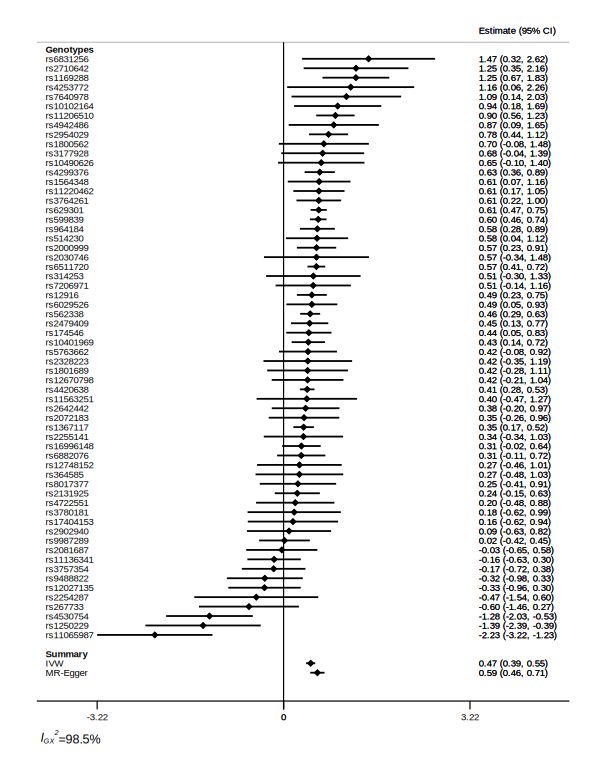
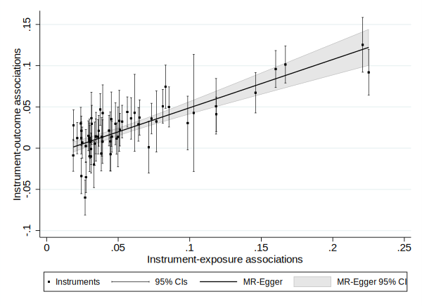

* [Run MR-Base from a Stata do-file or Stata Markdown script](#title)
  * [Introduction](#introduction)
  * [Extracting data from MR-Base](#extracting-data-from-mr-base)
  * [Performing the analysis using mrrobust in Stata](#performing-the-analysis-using-mrrobust-in-stata)
  * [References](#references)

# Run MR-Base from a Stata do-file or Stata Markdown script {#title}

## Introduction

This example shows how to run R and Stata code within the same Stata Markdown (`.stmd`) script. 
The general approach is detailed on the Stata Markdown website 
[here](https://data.princeton.edu/stata/markdown/quantiles) and 
[here](https://data.princeton.edu/stata/markdown/gettingStarted#R).

This means that we can use the functions provided by the 
[`TwoSampleMR`](https://github.com/MRCIEU/TwoSampleMR) package to obtain data from 
[MR-Base](http://www.mrbase.org/).

To see the `stmd` code which generates this page see 
[here](https://raw.githubusercontent.com/remlapmot/mrrobust/master/_drafts/markstat-call-R-example/markstat-call-R-example.stmd). 
You will see that the file is written in markdown and includes R and Stata code chunks.

Before you start please install the following two Stata packages from the SSC archive, so in Stata 
issue the following commands (I have commented them out because I have already installed them).

```stata
. * ssc install whereis
. * ssc install markstat
```


We first need to register the R executable with Stata.

```stata
. whereis R "C:\\Program Files\\R\\R-4.0.2\\bin\\R.exe"
C:\\Program Files\\R\\R-4.0.2\\bin\\R.exe
```


Next we have an R code chunk in which we install the required packages in R (again I have commented 
these lines out because I already have them installed).

```r
> # install.packages("devtools")
> # devtools::install_github("MRCIEU/TwoSampleMR")
> # devtools::install_github("MRCIEU/MRInstruments")
```


## Extracting data from MR-Base

We will be running the script from the MR-Base paper 
([Hemani et al., 2018](https://doi.org/10.7554/eLife.34408)). The R code we will use is from 
[here](https://raw.githubusercontent.com/explodecomputer/mr-base-methods-paper/master/scripts/ldl-chd.R).

First, we load the packages into our R session. Note that the `foreign` package provides the 
`write.dta()` function which we will use to save the data in Stata format.

```r
> library(TwoSampleMR)
> library(MRInstruments)
> library(foreign)
```


Our edited version of the code starts by reading in some code to generate a set of plots in R.

```r
> source("mrplots.R")
```


We can access the data using the `MRInstruments` package.

```r
> data(gwas_catalog)
> 
> # Get published SNPs for LDL cholesterol
> ldl_snps <- subset(gwas_catalog, grepl("LDL choles", Phenotype) & Author == "Willer CJ")$SNP
> 
> # Extract from GLGC dataset
> exposure <- convert_outcome_to_exposure(extract_outcome_data(ldl_snps, "ieu-a-300"))
> 
> # Get outcome data from Cardiogram 2015
> outcome <- extract_outcome_data(exposure$SNP, 7)
> 
> # Harmonise exposure and outcome datasets
> # Assume alleles are on the forward strand
> dat <- harmonise_data(exposure, outcome, action=1)
```

At this point we have our harmonised genotype-exposure and genotype-outcome association data saved 
in an object in our R session called `dat`.

The next two code chunks perform the analysis in R.

```r
> # Perform MR
> mr(dat)
  id.exposure id.outcome                              outcome
1   ieu-a-300    ieu-a-7 Coronary heart disease || id:ieu-a-7
2   ieu-a-300    ieu-a-7 Coronary heart disease || id:ieu-a-7
3   ieu-a-300    ieu-a-7 Coronary heart disease || id:ieu-a-7
4   ieu-a-300    ieu-a-7 Coronary heart disease || id:ieu-a-7
5   ieu-a-300    ieu-a-7 Coronary heart disease || id:ieu-a-7
                         exposure                    method nsnp         b
1 LDL cholesterol || id:ieu-a-300                  MR Egger   62 0.5853125
2 LDL cholesterol || id:ieu-a-300           Weighted median   62 0.4887311
3 LDL cholesterol || id:ieu-a-300 Inverse variance weighted   62 0.4689295
4 LDL cholesterol || id:ieu-a-300               Simple mode   62 0.4678942
5 LDL cholesterol || id:ieu-a-300             Weighted mode   62 0.5189450
          se         pval
1 0.06191076 1.712795e-13
2 0.03788048 4.389972e-38
3 0.03923672 6.392333e-33
4 0.06952032 6.722220e-09
5 0.03554062 1.417609e-21
> mr_heterogeneity(dat)
  id.exposure id.outcome                              outcome
1   ieu-a-300    ieu-a-7 Coronary heart disease || id:ieu-a-7
2   ieu-a-300    ieu-a-7 Coronary heart disease || id:ieu-a-7
                         exposure                    method        Q Q_df
1 LDL cholesterol || id:ieu-a-300                  MR Egger 170.9462   60
2 LDL cholesterol || id:ieu-a-300 Inverse variance weighted 187.0110   61
        Q_pval
1 1.356009e-12
2 1.021208e-14
> dat$exposure <- "LDL cholesterol"
> dat$outcome <- "Coronary heart disease"
> 
> # Label outliers and create plots
> dat$labels <- dat$SNP
> dat$labels[! dat$SNP %in% c("rs11065987", "rs1250229", "rs4530754")] <- NA
```


```r
> png("ldl-chd.png", width=1000, height=1000)
> mr_plots(dat)
> dev.off()
null device 
          1 
```


We now save our `dat` object as a Stata dataset.

```r
> write.dta(dat, file = "dat.dta")
```


## Performing the analysis using mrrobust in Stata

We now switch from using R code chunks to Stata code chunks. We read the data into Stata and list 
the variable names (note any `.` in the colnames of `dat` have been replaced with `_`).

```stata
. use dat, clear
(Written by R.              )

. ds, v(28)
SNP                     ambiguous               data_source_outcome     se_exposure
effect_allele_exposure  id_outcome              proxy_outcome           pval_exposure
other_allele_exposure   chr                     target_snp_outcome      mr_keep_exposure
effect_allele_outcome   pos                     proxy_snp_outcome       pval_origin_exposure
other_allele_outcome    se_outcome              target_a1_outcome       id_exposure
beta_exposure           samplesize_outcome      target_a2_outcome       action
beta_outcome            pval_outcome            proxy_a1_outcome        mr_keep
eaf_exposure            outcome                 proxy_a2_outcome        labels
eaf_outcome             originalname_outcome    exposure
remove                  outcome_deprecated      chr_exposure
palindromic             mr_keep_outcome         pos_exposure

. di _N
62
```


We can then run the IVW model using `mregger` with multiplicative standard errors.

```stata
. mregger beta_outcome beta_exposure [aw=1/(se_outcome^2)], ivw

                                                      Number of genotypes = 62
                                              Residual standard error =  1.751
──────────────┬────────────────────────────────────────────────────────────────
              │      Coef.   Std. Err.      z    P>|z|     [95% Conf. Interval]
──────────────┼────────────────────────────────────────────────────────────────
beta_outcome  │
beta_exposure │   .4689295   .0392367    11.95   0.000      .392027    .5458321
──────────────┴────────────────────────────────────────────────────────────────
```


It is helpful to view the forest plot of genotype specific IV estimates.

```stata
. mrforest beta_outcome se_outcome beta_exposure se_exposure, ivid(SNP) ///
> xlabel(-3,-2,-1,0,1,2,3)

. graph export ldl-chd-mrforest.svg, width(600) replace
(file ldl-chd-mrforest.svg written in SVG format)
```




We can visualise this model with `mreggerplot`.

```stata
. mreggerplot beta_outcome se_outcome beta_exposure se_exposure

. graph export ldl-chd-mreggerplot.svg, width(600) replace
(file ldl-chd-mreggerplot.svg written in SVG format)
```




We then fit the MR-Egger, median, and modal based estimators.

```stata
. mregger beta_outcome beta_exposure [aw=1/(se_outcome^2)]

                                                      Number of genotypes = 62
                                              Residual standard error =  1.688
─────────────┬────────────────────────────────────────────────────────────────
             │      Coef.   Std. Err.      z    P>|z|     [95% Conf. Interval]
─────────────┼────────────────────────────────────────────────────────────────
beta_outcome │
       slope │   .5853125   .0619108     9.45   0.000     .4639696    .7066554
       _cons │  -.0095226   .0040103    -2.37   0.018    -.0173826   -.0016626
─────────────┴────────────────────────────────────────────────────────────────
```


```stata
. mrmedian beta_outcome se_outcome beta_exposure se_exposure, weighted

                                                      Number of genotypes = 62
                                                           Replications = 1000
─────────────┬────────────────────────────────────────────────────────────────
             │      Coef.   Std. Err.      z    P>|z|     [95% Conf. Interval]
─────────────┼────────────────────────────────────────────────────────────────
        beta │   .4887676   .0369263    13.24   0.000     .4163933    .5611419
─────────────┴────────────────────────────────────────────────────────────────
```


```stata
. mrmodal beta_outcome se_outcome beta_exposure se_exposure, weighted

                                                      Number of genotypes = 62
                                                           Replications = 1000
                                                                       Phi = 1
─────────────┬────────────────────────────────────────────────────────────────
             │      Coef.   Std. Err.      z    P>|z|     [95% Conf. Interval]
─────────────┼────────────────────────────────────────────────────────────────
        beta │    .518945     .03687    14.07   0.000     .4466811    .5912089
─────────────┴────────────────────────────────────────────────────────────────
```


And we could continue with additional Stata code (or indeed R code) as we liked.

Note to run this `.stmd` file in Stata we do so with the following command (specifying additional 
options as required, see `help markstat` for more information).
```
markstat using markstat-call-R-example
```

## References

- Hemani et al. The MR-Base platform supports systematic causal inference across the human phenome. 
eLife, 2018;7:e34408 <https://doi.org/10.7554/eLife.34408>
