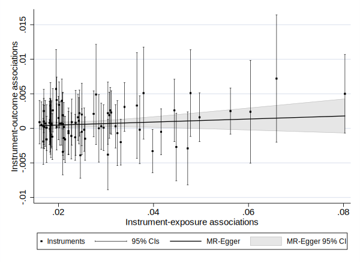
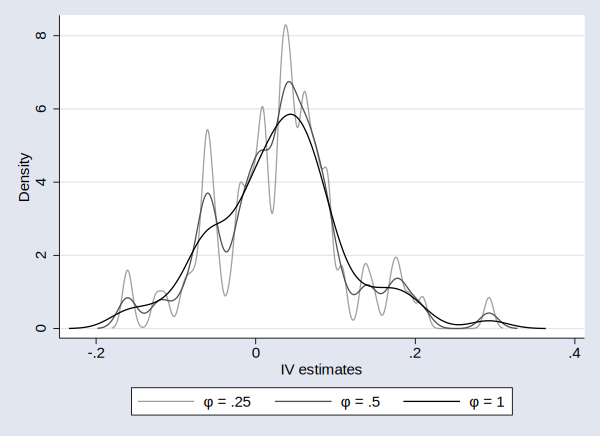
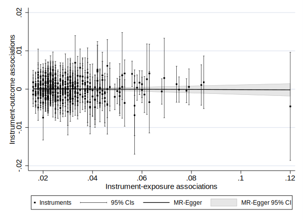
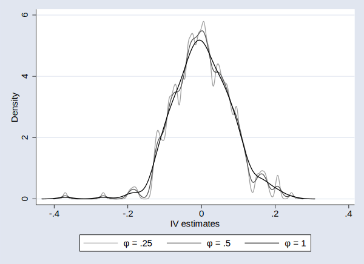

* [Examples from our IJE paper](#examples-from-our-ije-paper)
  * [mrrobust set-up](#mrrobust-set-up)
  * [Summary data description and overview](#summary-data-description-and-overview)
  * [Stata output for each estimation method using mrrobust: BMI-Serum Glucose](#estimation)
  * [Stata output using the mode-based estimator using mrrobust: BMI-Serum Glucose](#mode)
  * [Stata output for each estimation method using mrrobust: Height-Serum Glucose](#height)
  * [Stata output using the mode-based estimator using mrrobust: Height-Serum Glucose](#height-mode)
  * [References](#references)

# Examples from our IJE paper

The paper is available [here](https://doi.org/10.1093/ije/dyy195).

## mrrobust set-up
Install the `mrrobust` package using the user-written `github` package.

```
net install github, from("https://haghish.github.io/github/")
gitget mrrobust
```
If you have Stata 12 or earlier you will need to install some of these manually 
(see [here](https://remlapmot.github.io/mrrobust/#installing-and-updating-mrrobust) 
for instructions).

## Summary data description and overview
Accompanying this paper are two sets of data `BMI.csv`, and `Height.csv`, containing the set of 
summary estimates required for performing the BMI-serum glucose and height-serum glucose analyses 
respectively. Each dataset is organised into 5 columns under the following headings:

* `SNP`: A set of identifying numbers (rsids) for each genetic variant
* `beta.exposure`: a set of values representing the coefficient from regressing the exposure upon 
the genetic variant within a GWAS
* `beta.outcome`: a set of values representing the coefficient from regressing the outcome upon 
the genetic variant within a GWAS
* `se.exposure`: a set of values representing the standard error corresponding to the coefficient 
in beta.exposure
* `se.outcome`: a set of values representing the standard error corresponding to the coefficient 
in beta.outcome.

Note Stata removes the `.` in the variable names when the data is imported.

In `BMI.csv` the exposure is standardised body mass index (BMI), and is therefore interpreted on a
standard deviation scale. The summary statistics are reported by Locke et al.
In `Height.csv` the exposure is standardised height in meters and also interpreted on a standard
deviation scale. The summary statistics are reported by Wood et al.

For both analyses log transformed serum glucose was used as an outcome, reported by Shin et al.
All the data was obtained from the MRBase GWAS catalogue available at <https://www.mrbase.org/>. 
Genetic variants were pruned so as to be independent ($R^2$ = 0.0001), and the effect alleles were 
aligned between the exposure and outcome datasets using the MRBase web application, prior to 
implementing `mrrobust`.

## Stata output for each estimation method using mrrobust: BMI-Serum Glucose {#estimation}
### Read in data

```stata
. import delimited using BMI.csv, clear
(encoding automatically selected: ISO-8859-1)
(41 vars, 79 obs)
```


### IVW

```stata
. mregger betaoutcome betaexposure [aw=1/(seoutcome^2)], ivw

                                                      Number of genotypes = 79
                                              Residual standard error =  1.039
─────────────┬────────────────────────────────────────────────────────────────
             │ Coefficient  Std. err.      z    P>|z|     [95% conf. interval]
─────────────┼────────────────────────────────────────────────────────────────
betaoutcome  │
betaexposure │   .0231866   .0079957     2.90   0.004     .0075154    .0388578
─────────────┴────────────────────────────────────────────────────────────────
```


### MR-Egger

```stata
. mregger betaoutcome betaexposure [aw=1/(seoutcome^2)]

                                                      Number of genotypes = 79
                                              Residual standard error =  1.046
─────────────┬────────────────────────────────────────────────────────────────
             │ Coefficient  Std. err.      z    P>|z|     [95% conf. interval]
─────────────┼────────────────────────────────────────────────────────────────
betaoutcome  │
       slope │   .0218507   .0221852     0.98   0.325    -.0216315    .0653329
       _cons │    .000038   .0005877     0.06   0.948    -.0011138    .0011897
─────────────┴────────────────────────────────────────────────────────────────
```


### Plot of the MR-Egger model

```stata
. mreggerplot betaoutcome seoutcome betaexposure seexposure

. qui gr export mreggerplot-bmi.svg, width(600) replace
```


{:style="text-align:center;"}


    
### Weighted median

```stata
. mrmedian betaoutcome seoutcome betaexposure seexposure, ///
>     weighted seed(300818)

                                                      Number of genotypes = 79
                                                           Replications = 1000
─────────────┬────────────────────────────────────────────────────────────────
             │ Coefficient  Std. err.      z    P>|z|     [95% conf. interval]
─────────────┼────────────────────────────────────────────────────────────────
        beta │   .0339256   .0120248     2.82   0.005     .0103576    .0574937
─────────────┴────────────────────────────────────────────────────────────────
```


## Stata output using the mode-based estimator using mrrobust: BMI-Serum Glucose {#mode}
Using the `mrmodalplot` command, modal estimates are calculated using bandwidths of 0.25,
0.5, and 1 respectively. This command also produces three overlaid density plots for each
value, as shown in the Figure.

```stata
. mrmodalplot betaoutcome seoutcome betaexposure seexposure, ///
>     lc(gs10 gs5 gs0) seed(300818)

                                                      Number of genotypes = 79
                                                           Replications = 1000
                                                                     Phi = .25
─────────────┬────────────────────────────────────────────────────────────────
             │ Coefficient  Std. err.      z    P>|z|     [95% conf. interval]
─────────────┼────────────────────────────────────────────────────────────────
        beta │   .0374507   .0424036     0.88   0.377    -.0456588    .1205602
─────────────┴────────────────────────────────────────────────────────────────

                                                      Number of genotypes = 79
                                                           Replications = 1000
                                                                      Phi = .5
─────────────┬────────────────────────────────────────────────────────────────
             │ Coefficient  Std. err.      z    P>|z|     [95% conf. interval]
─────────────┼────────────────────────────────────────────────────────────────
        beta │   .0416424   .0369758     1.13   0.260    -.0308289    .1141137
─────────────┴────────────────────────────────────────────────────────────────

                                                      Number of genotypes = 79
                                                           Replications = 1000
                                                                       Phi = 1
─────────────┬────────────────────────────────────────────────────────────────
             │ Coefficient  Std. err.      z    P>|z|     [95% conf. interval]
─────────────┼────────────────────────────────────────────────────────────────
        beta │   .0431816   .0281684     1.53   0.125    -.0120274    .0983906
─────────────┴────────────────────────────────────────────────────────────────

. qui gr export mrmodalplot-bmi.svg, width(600) replace
```


{:style="text-align:center;"}


    
## Stata output for each estimation method using mrrobust: Height-Serum Glucose {#height}
### Read in data

```stata
. import delimited using Height.csv, clear
(encoding automatically selected: ISO-8859-1)
(41 vars, 367 obs)
```


### IVW

```stata
. mregger betaoutcome betaexposure [aw=1/(seoutcome^2)], ivw

                                                     Number of genotypes = 367
                                              Residual standard error =  1.044
─────────────┬────────────────────────────────────────────────────────────────
             │ Coefficient  Std. err.      z    P>|z|     [95% conf. interval]
─────────────┼────────────────────────────────────────────────────────────────
betaoutcome  │
betaexposure │   .0015412   .0033017     0.47   0.641      -.00493    .0080124
─────────────┴────────────────────────────────────────────────────────────────
```


### MR-Egger

```stata
. mregger betaoutcome betaexposure [aw=1/(seoutcome^2)]

                                                     Number of genotypes = 367
                                              Residual standard error =  1.045
─────────────┬────────────────────────────────────────────────────────────────
             │ Coefficient  Std. err.      z    P>|z|     [95% conf. interval]
─────────────┼────────────────────────────────────────────────────────────────
betaoutcome  │
       slope │  -.0025878   .0091178    -0.28   0.777    -.0204584    .0152828
       _cons │   .0001338   .0002754     0.49   0.627     -.000406    .0006736
─────────────┴────────────────────────────────────────────────────────────────
```


### Plot of the MR-Egger model

```stata
. mreggerplot betaoutcome seoutcome betaexposure seexposure

. qui gr export mreggerplot-height.svg, width(600) replace
```


{:style="text-align:center;"}


    
### Weighted median

```stata
. mrmedian betaoutcome seoutcome betaexposure seexposure, ///
>     weighted seed(300818)

                                                     Number of genotypes = 367
                                                           Replications = 1000
─────────────┬────────────────────────────────────────────────────────────────
             │ Coefficient  Std. err.      z    P>|z|     [95% conf. interval]
─────────────┼────────────────────────────────────────────────────────────────
        beta │          0   .0052323     0.00   1.000    -.0102551    .0102551
─────────────┴────────────────────────────────────────────────────────────────
```


## Stata output using the mode-based estimator using mrrobust: Height-Serum Glucose {#height-mode}

```stata
. mrmodalplot betaoutcome seoutcome betaexposure seexposure, ///
>     lc(gs10 gs5 gs0) seed(300818)

                                                     Number of genotypes = 367
                                                           Replications = 1000
                                                                     Phi = .25
─────────────┬────────────────────────────────────────────────────────────────
             │ Coefficient  Std. err.      z    P>|z|     [95% conf. interval]
─────────────┼────────────────────────────────────────────────────────────────
        beta │   .0061368   .0245472     0.25   0.803    -.0419748    .0542484
─────────────┴────────────────────────────────────────────────────────────────

                                                     Number of genotypes = 367
                                                           Replications = 1000
                                                                      Phi = .5
─────────────┬────────────────────────────────────────────────────────────────
             │ Coefficient  Std. err.      z    P>|z|     [95% conf. interval]
─────────────┼────────────────────────────────────────────────────────────────
        beta │   .0015595   .0212232     0.07   0.941    -.0400372    .0431561
─────────────┴────────────────────────────────────────────────────────────────

                                                     Number of genotypes = 367
                                                           Replications = 1000
                                                                       Phi = 1
─────────────┬────────────────────────────────────────────────────────────────
             │ Coefficient  Std. err.      z    P>|z|     [95% conf. interval]
─────────────┼────────────────────────────────────────────────────────────────
        beta │  -.0054772   .0149074    -0.37   0.713    -.0346952    .0237408
─────────────┴────────────────────────────────────────────────────────────────

. qui gr export mrmodalplot-height.svg, width(600) replace
```


{:style="text-align:center;"}


## References

1. Locke AE, Kahali B, Berndt SI, Justice AE, Pers TH, Day FR, et al. Genetic studies of body mass 
index yield new insights for obesity biology. Nature. 2015;518(7538):197-206.
2. Wood AR, Esko T, Yang J, Vedantam S, Pers TH, Gustafsson S, et al. Defining the role of common 
variation in the genomic and biological architecture of adult human height. Nat Genet.
2014;46(11):1173-86.
3. Shin S-Y, Fauman EB, Petersen A-K, Krumsiek J, Santos R, Huang J, et al. An atlas of genetic 
influences on human blood metabolites. Nat Genet. 2014;46(6):543-50.
4. Hemani G, Zheng J, Elsworth B, Wade KH, Haberland V, Baird D, et al. The MR-Base platform 
supports systematic causal inference across the human phenome. eLife. 2018;7:e34408. <https://doi.org/10.7554/eLife.34408>
