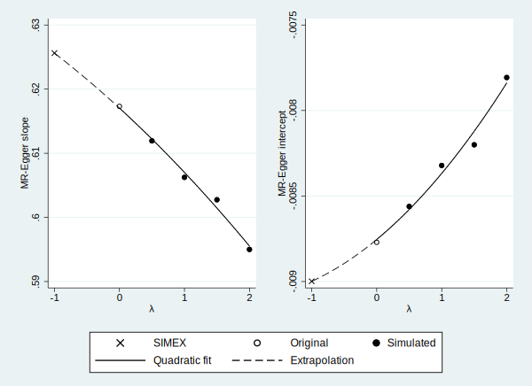
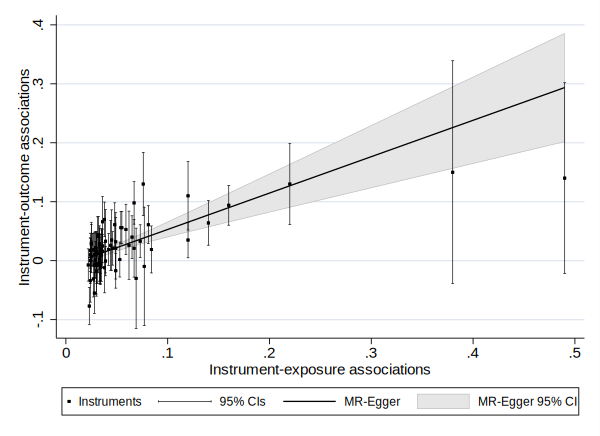
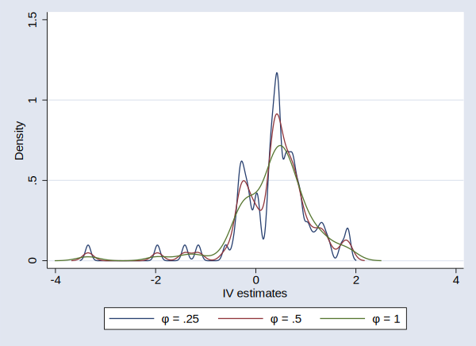
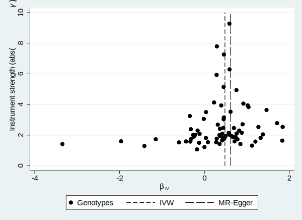

## Install dependencies and mrrobust package
```
ssc install addplot
ssc install kdens
ssc install moremata
ssc install heterogi
ssc install metan
net install grc1leg, from(http://www.stata.com/users/vwiggins)
net install mrrobust, ///
    from(https://raw.github.com/remlapmot/mrrobust/master/) ///
    replace
```
    
## Examples

Read in example data.

```stata
. use https://raw.github.com/remlapmot/mrrobust/master/dodata, clear
```


Select observations (*p*-value with exposure < 10^-8^).

```stata
. gen byte sel1 = (ldlcp2 < 1e-8)
```


## mrforest examples
Forest plot of genotype specific IV estimates and IVW and MR-Egger estimates, 
labelling the genotypes with their RSID.

```stata
. mrforest chdbeta chdse ldlcbeta ldlcse if sel1==1, ///
>     ivid(rsid) ///
>     xlabel(-5,-4,-3,-2,-1,0,1,2,3,4,5)

. gr export mrforest.svg, width(600) replace
(note: file mrforest.svg not found)
(file mrforest.svg written in SVG format)
```


## mregger examples
Using the data provided by Do et al., Nat Gen, 2013 recreate Bowden et al., 
Gen Epi, 2016, Table 4, LDL-c "All genetic variants" estimates.

IVW (with fixed effect standard errors, i.e. variance of residuals 
[residual variance] constrained to 1).

```stata
. mregger chdbeta ldlcbeta [aw=1/(chdse^2)] if sel1==1, ivw fe

                                                      Number of genotypes = 73
─────────────┬────────────────────────────────────────────────────────────────
             │      Coef.   Std. Err.      z    P>|z|     [95% Conf. Interval]
─────────────┼────────────────────────────────────────────────────────────────
chdbeta      │
    ldlcbeta │   .4815055    .038221    12.60   0.000     .4065938    .5564173
─────────────┴────────────────────────────────────────────────────────────────
```


MR-Egger (with SEs using an unconstrained residual variance 
[multiplicative random effects]).

```stata
. mregger chdbeta ldlcbeta [aw=1/(chdse^2)] if sel1==1

                                                      Number of genotypes = 73
─────────────┬────────────────────────────────────────────────────────────────
             │      Coef.   Std. Err.      z    P>|z|     [95% Conf. Interval]
─────────────┼────────────────────────────────────────────────────────────────
sign(ldlcb~a)│
chdbeta      │
       slope │   .6173131   .1034573     5.97   0.000     .4145405    .8200858
       _cons │  -.0087706   .0054812    -1.60   0.110    -.0195136    .0019723
─────────────┴────────────────────────────────────────────────────────────────
Residual standard error:  1.548
```


MR-Egger reporting I^2_GX statistic and heterogeneity Q-test.

```stata
. mregger chdbeta ldlcbeta [aw=1/(chdse^2)] if sel1==1, ///
>     gxse(ldlcse) heterogi

                                                      Number of genotypes = 73
─────────────┬────────────────────────────────────────────────────────────────
             │      Coef.   Std. Err.      z    P>|z|     [95% Conf. Interval]
─────────────┼────────────────────────────────────────────────────────────────
sign(ldlcb~a)│
chdbeta      │
       slope │   .6173131   .1034573     5.97   0.000     .4145405    .8200858
       _cons │  -.0087706   .0054812    -1.60   0.110    -.0195136    .0019723
─────────────┴────────────────────────────────────────────────────────────────
Residual standard error:  1.548
Heterogeneity/pleiotropy statistics:
──────────┬───────────────────────────────────────────
Statistic │       Estimate        [95% Conf. Interval]
──────────┼───────────────────────────────────────────
        H │          1.5               1.4    1.8     
      I^2 │          58                 46    68      
──────────┴───────────────────────────────────────────
Q-test = 170.11187 d.f. = 71 p-value = 0.0000
I^2_GX statistic:  98.49%
```


MR-Egger using a t-distribution for inference (p-values) & CI limits.

```stata
. mregger chdbeta ldlcbeta [aw=1/(chdse^2)] if sel1==1, tdist

                                                      Number of genotypes = 73
─────────────┬────────────────────────────────────────────────────────────────
             │      Coef.   Std. Err.      t    P>|t|     [95% Conf. Interval]
─────────────┼────────────────────────────────────────────────────────────────
sign(ldlcb~a)│
chdbeta      │
       slope │   .6173131   .1034573     5.97   0.000     .4110251    .8236012
       _cons │  -.0087706   .0054812    -1.60   0.114    -.0196998    .0021585
─────────────┴────────────────────────────────────────────────────────────────
Residual standard error:  1.548
```


MR-Egger using the radial formulation.

```stata
. mregger chdbeta ldlcbeta [aw=1/(chdse^2)] if sel1==1, radial

                                                      Number of genotypes = 73
─────────────┬────────────────────────────────────────────────────────────────
             │      Coef.   Std. Err.      z    P>|z|     [95% Conf. Interval]
─────────────┼────────────────────────────────────────────────────────────────
radialGD     │
    radialGP │    .642582   .1157871     5.55   0.000     .4156434    .8695205
       _cons │  -.5737301   .3545658    -1.62   0.106    -1.268666    .1212062
─────────────┴────────────────────────────────────────────────────────────────
Residual standard error:  1.547
```


MR-Egger using the radial formulation and reporting heterogeneity (Rucker's) Q-test.

```stata
. mregger chdbeta ldlcbeta [aw=1/(chdse^2)] if sel1==1, ///
>     radial heterogi

                                                      Number of genotypes = 73
─────────────┬────────────────────────────────────────────────────────────────
             │      Coef.   Std. Err.      z    P>|z|     [95% Conf. Interval]
─────────────┼────────────────────────────────────────────────────────────────
radialGD     │
    radialGP │    .642582   .1157871     5.55   0.000     .4156434    .8695205
       _cons │  -.5737301   .3545658    -1.62   0.106    -1.268666    .1212062
─────────────┴────────────────────────────────────────────────────────────────
Residual standard error:  1.547
Heterogeneity/pleiotropy statistics:
──────────┬───────────────────────────────────────────
Statistic │       Estimate        [95% Conf. Interval]
──────────┼───────────────────────────────────────────
        H │          1.5               1.4    1.8     
      I^2 │          58                 46    68      
──────────┴───────────────────────────────────────────
Q-test = 169.97877 d.f. = 71 p-value = 0.0000
```


## mreggersimex examples
SIMEX suppressing bootstrapped SEs (for speed - remove `noboot` option to obtain 
SEs).

```stata
. mreggersimex chdbeta ldlcbeta [aw=1/chdse^2] if sel1==1, ///
>     gxse(ldlcse) seed(12345) noboot

                                                      Number of genotypes = 73
                                                    Bootstrap replications = 0
                                                  Simulation replications = 50
─────────────┬────────────────────────────────────────────────────────────────
             │      Coef.   Std. Err.      z    P>|z|     [95% Conf. Interval]
─────────────┼────────────────────────────────────────────────────────────────
       slope │   .6256194          .        .       .            .           .
       _cons │  -.0089987          .        .       .            .           .
─────────────┴────────────────────────────────────────────────────────────────

. gr export mreggersimex-plot.svg, width(600) replace
(note: file mreggersimex-plot.svg not found)
(file mreggersimex-plot.svg written in SVG format)
```




## mreggerplot examples

```stata
. mreggerplot chdbeta chdse ldlcbeta ldlcse if sel1==1

. gr export mreggerplot.svg, width(600) replace
(note: file mreggerplot.svg not found)
(file mreggerplot.svg written in SVG format)
```




## mrmedian examples
Weighted median estimator.

```stata
. mrmedian chdbeta chdse ldlcbeta ldlcse if sel1==1, weighted

                                                      Number of genotypes = 73
                                                           Replications = 1000
─────────────┬────────────────────────────────────────────────────────────────
             │      Coef.   Std. Err.      z    P>|z|     [95% Conf. Interval]
─────────────┼────────────────────────────────────────────────────────────────
        beta │   .4582573   .0624892     7.33   0.000     .3357807    .5807339
─────────────┴────────────────────────────────────────────────────────────────
```


## mrmodal examples

```stata
. mrmodalplot chdbeta chdse ldlcbeta ldlcse if sel1==1

                                                      Number of genotypes = 73
                                                           Replications = 1000
                                                                     Phi = .25
─────────────┬────────────────────────────────────────────────────────────────
             │      Coef.   Std. Err.      z    P>|z|     [95% Conf. Interval]
─────────────┼────────────────────────────────────────────────────────────────
        beta │   .4198713   .2237762     1.88   0.061    -.0187219    .8584645
─────────────┴────────────────────────────────────────────────────────────────

                                                      Number of genotypes = 73
                                                           Replications = 1000
                                                                      Phi = .5
─────────────┬────────────────────────────────────────────────────────────────
             │      Coef.   Std. Err.      z    P>|z|     [95% Conf. Interval]
─────────────┼────────────────────────────────────────────────────────────────
        beta │   .4218667   .1950497     2.16   0.031     .0395764    .8041571
─────────────┴────────────────────────────────────────────────────────────────

                                                      Number of genotypes = 73
                                                           Replications = 1000
                                                                       Phi = 1
─────────────┬────────────────────────────────────────────────────────────────
             │      Coef.   Std. Err.      z    P>|z|     [95% Conf. Interval]
─────────────┼────────────────────────────────────────────────────────────────
        beta │   .4917353   .1331011     3.69   0.000     .2308619    .7526086
─────────────┴────────────────────────────────────────────────────────────────

. gr export mrmodalplot.svg, width(600) replace
(note: file mrmodalplot.svg not found)
(file mrmodalplot.svg written in SVG format)
```



Simple mode estimator.

```stata
. mrmodal chdbeta chdse ldlcbeta ldlcse if sel1==1

                                                      Number of genotypes = 73
                                                           Replications = 1000
                                                                       Phi = 1
─────────────┬────────────────────────────────────────────────────────────────
             │      Coef.   Std. Err.      z    P>|z|     [95% Conf. Interval]
─────────────┼────────────────────────────────────────────────────────────────
        beta │   .4917353   .1312092     3.75   0.000     .2345699    .7489007
─────────────┴────────────────────────────────────────────────────────────────
```


Weighted mode estimator.

```stata
. mrmodal chdbeta chdse ldlcbeta ldlcse if sel1==1, weighted

                                                      Number of genotypes = 73
                                                           Replications = 1000
                                                                       Phi = 1
─────────────┬────────────────────────────────────────────────────────────────
             │      Coef.   Std. Err.      z    P>|z|     [95% Conf. Interval]
─────────────┼────────────────────────────────────────────────────────────────
        beta │   .4789702   .0663424     7.22   0.000     .3489415    .6089989
─────────────┴────────────────────────────────────────────────────────────────
```


Simple mode estimator with NOME assumption.

```stata
. mrmodal chdbeta chdse ldlcbeta ldlcse if sel1==1, nome

                                                      Number of genotypes = 73
                                                           Replications = 1000
                                                                       Phi = 1
─────────────┬────────────────────────────────────────────────────────────────
             │      Coef.   Std. Err.      z    P>|z|     [95% Conf. Interval]
─────────────┼────────────────────────────────────────────────────────────────
        beta │   .4917353   .1306138     3.76   0.000      .235737    .7477336
─────────────┴────────────────────────────────────────────────────────────────
```


## mrfunnel examples

```stata
. mrfunnel chdbeta chdse ldlcbeta ldlcse if sel1==1

. gr export mrfunnel.svg, width(600) replace
(note: file mrfunnel.svg not found)
(file mrfunnel.svg written in SVG format)
```


