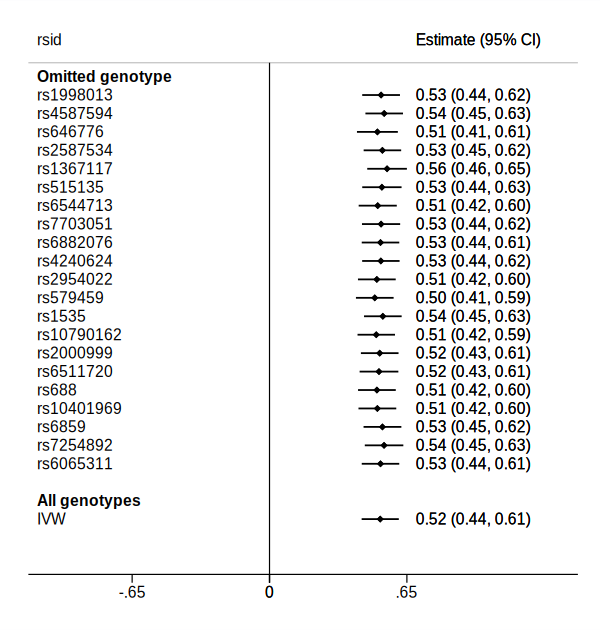
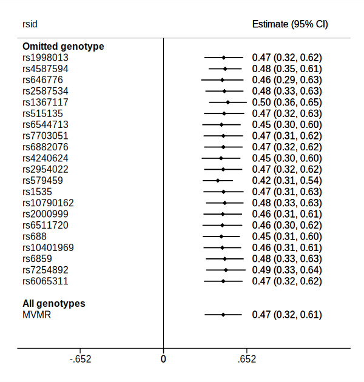

# Examples from helpfiles in the mrrobust package

## Install the mrrobust package
```
net install github, from("https://haghish.github.io/github/")
gitget mrrobust
```
    
## Read in example data

Read in example data.

```stata
. use https://raw.github.com/remlapmot/mrrobust/master/dodata, clear
```


Select observations (*p*-value with exposure < 10^-8^).

```stata
. gen byte sel1 = (ldlcp2 < 1e-8)
```


## mrforest examples
Forest plot of genotype specific IV estimates and IVW and MR-Egger estimates, 
labelling the genotypes with their RSID.

```stata
. mrforest chdbeta chdse ldlcbeta ldlcse if sel1==1, ///
> ivid(rsid) ///
> xlabel(-5,-4,-3,-2,-1,0,1,2,3,4,5)

. gr export mrforest.svg, width(600) replace
(file mrforest.svg written in SVG format)
```


## mregger examples
Using the data provided by [Do et al. (2013)](https://doi.org/10.1038/ng.2795) 
recreate [Bowden et al. (2016)](https://doi.org/10.1002/gepi.21965), 
Table 4, LDL-c "All genetic variants" estimates.

IVW (with fixed effect standard errors, i.e. variance of residuals 
[residual variance] constrained to 1).

```stata
. mregger chdbeta ldlcbeta [aw=1/(chdse^2)] if sel1==1, ivw fe

                                                      Number of genotypes = 73
                                      Residual standard error constrained at 1
─────────────┬────────────────────────────────────────────────────────────────
             │      Coef.   Std. Err.      z    P>|z|     [95% Conf. Interval]
─────────────┼────────────────────────────────────────────────────────────────
chdbeta      │
    ldlcbeta │   .4815055    .038221    12.60   0.000     .4065938    .5564173
─────────────┴────────────────────────────────────────────────────────────────
```


MR-Egger (with SEs using an unconstrained residual variance 
[multiplicative random effects]).

```stata
. mregger chdbeta ldlcbeta [aw=1/(chdse^2)] if sel1==1

                                                      Number of genotypes = 73
                                              Residual standard error =  1.548
─────────────┬────────────────────────────────────────────────────────────────
             │      Coef.   Std. Err.      z    P>|z|     [95% Conf. Interval]
─────────────┼────────────────────────────────────────────────────────────────
chdbeta      │
       slope │   .6173131   .1034573     5.97   0.000     .4145405    .8200858
       _cons │  -.0087706   .0054812    -1.60   0.110    -.0195136    .0019723
─────────────┴────────────────────────────────────────────────────────────────
```


MR-Egger reporting I^2_GX statistic and heterogeneity Q-test.

```stata
. mregger chdbeta ldlcbeta [aw=1/(chdse^2)] if sel1==1, ///
> gxse(ldlcse) heterogi

                                           Q_GX statistic (weighted) = 3454.26
                                         I^2_GX statistic (weighted) =  97.92%
                                                      Number of genotypes = 73
                                              Residual standard error =  1.548
                                Heterogeneity; chi2(71) = 170.11 (p =  0.0000)
─────────────┬────────────────────────────────────────────────────────────────
             │      Coef.   Std. Err.      z    P>|z|     [95% Conf. Interval]
─────────────┼────────────────────────────────────────────────────────────────
chdbeta      │
       slope │   .6173131   .1034573     5.97   0.000     .4145405    .8200858
       _cons │  -.0087706   .0054812    -1.60   0.110    -.0195136    .0019723
─────────────┴────────────────────────────────────────────────────────────────
```


MR-Egger using a t-distribution for inference (p-values) & CI limits.

```stata
. mregger chdbeta ldlcbeta [aw=1/(chdse^2)] if sel1==1, tdist

                                                      Number of genotypes = 73
                                              Residual standard error =  1.548
─────────────┬────────────────────────────────────────────────────────────────
             │      Coef.   Std. Err.      t    P>|t|     [95% Conf. Interval]
─────────────┼────────────────────────────────────────────────────────────────
chdbeta      │
       slope │   .6173131   .1034573     5.97   0.000     .4110251    .8236012
       _cons │  -.0087706   .0054812    -1.60   0.114    -.0196998    .0021585
─────────────┴────────────────────────────────────────────────────────────────
```


MR-Egger using the radial formulation.

```stata
. mregger chdbeta ldlcbeta [aw=1/(chdse^2)] if sel1==1, radial

                                                      Number of genotypes = 73
                                              Residual standard error =  1.547
─────────────┬────────────────────────────────────────────────────────────────
             │      Coef.   Std. Err.      z    P>|z|     [95% Conf. Interval]
─────────────┼────────────────────────────────────────────────────────────────
radialGD     │
    radialGP │    .642582   .1157871     5.55   0.000     .4156434    .8695205
       _cons │  -.5737301   .3545658    -1.62   0.106    -1.268666    .1212062
─────────────┴────────────────────────────────────────────────────────────────
```


MR-Egger using the radial formulation and reporting heterogeneity (Rucker's) Q-test.

```stata
. mregger chdbeta ldlcbeta [aw=1/(chdse^2)] if sel1==1, ///
> radial heterogi

                                                      Number of genotypes = 73
                                              Residual standard error =  1.547
                                Heterogeneity; chi2(71) = 169.98 (p =  0.0000)
─────────────┬────────────────────────────────────────────────────────────────
             │      Coef.   Std. Err.      z    P>|z|     [95% Conf. Interval]
─────────────┼────────────────────────────────────────────────────────────────
radialGD     │
    radialGP │    .642582   .1157871     5.55   0.000     .4156434    .8695205
       _cons │  -.5737301   .3545658    -1.62   0.106    -1.268666    .1212062
─────────────┴────────────────────────────────────────────────────────────────
```


## mreggersimex examples
SIMEX suppressing bootstrapped SEs (for speed - remove `noboot` option to obtain 
SEs).

```stata
. mreggersimex chdbeta ldlcbeta [aw=1/chdse^2] if sel1==1, ///
> gxse(ldlcse) seed(12345) noboot

                                                      Number of genotypes = 73
                                                    Bootstrap replications = 0
                                                  Simulation replications = 50
─────────────┬────────────────────────────────────────────────────────────────
             │      Coef.   Std. Err.      z    P>|z|     [95% Conf. Interval]
─────────────┼────────────────────────────────────────────────────────────────
       slope │   .6256194          .        .       .            .           .
       _cons │  -.0089987          .        .       .            .           .
─────────────┴────────────────────────────────────────────────────────────────

. gr export mreggersimex-plot.svg, width(600) replace
(file mreggersimex-plot.svg written in SVG format)
```


## mreggerplot examples

```stata
. mreggerplot chdbeta chdse ldlcbeta ldlcse if sel1==1

. gr export mreggerplot.svg, width(600) replace
(file mreggerplot.svg written in SVG format)
```


## mrmedian examples
Weighted median estimator.

```stata
. mrmedian chdbeta chdse ldlcbeta ldlcse if sel1==1, weighted

                                                      Number of genotypes = 73
                                                           Replications = 1000
─────────────┬────────────────────────────────────────────────────────────────
             │      Coef.   Std. Err.      z    P>|z|     [95% Conf. Interval]
─────────────┼────────────────────────────────────────────────────────────────
        beta │   .4582573   .0624892     7.33   0.000     .3357807    .5807339
─────────────┴────────────────────────────────────────────────────────────────
```


## mrmodal examples

```stata
. mrmodalplot chdbeta chdse ldlcbeta ldlcse if sel1==1, seed(12345)

                                                      Number of genotypes = 73
                                                           Replications = 1000
                                                                     Phi = .25
─────────────┬────────────────────────────────────────────────────────────────
             │      Coef.   Std. Err.      z    P>|z|     [95% Conf. Interval]
─────────────┼────────────────────────────────────────────────────────────────
        beta │   .4198713   .2267297     1.85   0.064    -.0245107    .8642533
─────────────┴────────────────────────────────────────────────────────────────

                                                      Number of genotypes = 73
                                                           Replications = 1000
                                                                      Phi = .5
─────────────┬────────────────────────────────────────────────────────────────
             │      Coef.   Std. Err.      z    P>|z|     [95% Conf. Interval]
─────────────┼────────────────────────────────────────────────────────────────
        beta │   .4218667   .1981169     2.13   0.033     .0335647    .8101688
─────────────┴────────────────────────────────────────────────────────────────

                                                      Number of genotypes = 73
                                                           Replications = 1000
                                                                       Phi = 1
─────────────┬────────────────────────────────────────────────────────────────
             │      Coef.   Std. Err.      z    P>|z|     [95% Conf. Interval]
─────────────┼────────────────────────────────────────────────────────────────
        beta │   .4917353   .1356432     3.63   0.000     .2258796     .757591
─────────────┴────────────────────────────────────────────────────────────────

. gr export mrmodalplot.svg, width(600) replace
(file mrmodalplot.svg written in SVG format)
```


Simple mode estimator.

```stata
. mrmodal chdbeta chdse ldlcbeta ldlcse if sel1==1

                                                      Number of genotypes = 73
                                                           Replications = 1000
                                                                       Phi = 1
─────────────┬────────────────────────────────────────────────────────────────
             │      Coef.   Std. Err.      z    P>|z|     [95% Conf. Interval]
─────────────┼────────────────────────────────────────────────────────────────
        beta │   .4917353   .1314983     3.74   0.000     .2340034    .7494672
─────────────┴────────────────────────────────────────────────────────────────
```


Weighted mode estimator.

```stata
. mrmodal chdbeta chdse ldlcbeta ldlcse if sel1==1, weighted

                                                      Number of genotypes = 73
                                                           Replications = 1000
                                                                       Phi = 1
─────────────┬────────────────────────────────────────────────────────────────
             │      Coef.   Std. Err.      z    P>|z|     [95% Conf. Interval]
─────────────┼────────────────────────────────────────────────────────────────
        beta │   .4789702    .067441     7.10   0.000     .3467882    .6111522
─────────────┴────────────────────────────────────────────────────────────────
```


Simple mode estimator with NOME assumption.

```stata
. mrmodal chdbeta chdse ldlcbeta ldlcse if sel1==1, nome

                                                      Number of genotypes = 73
                                                           Replications = 1000
                                                                       Phi = 1
─────────────┬────────────────────────────────────────────────────────────────
             │      Coef.   Std. Err.      z    P>|z|     [95% Conf. Interval]
─────────────┼────────────────────────────────────────────────────────────────
        beta │   .4917353   .1341723     3.66   0.000     .2287624    .7547081
─────────────┴────────────────────────────────────────────────────────────────
```


## mrfunnel examples

```stata
. mrfunnel chdbeta chdse ldlcbeta ldlcse if sel1==1

. gr export mrfunnel.svg, width(600) replace
(file mrfunnel.svg written in SVG format)
```


## Leave one out analysis
Create a smaller subset of data.

```stata
. gen byte sel2 = (ldlcp2 < 1e-25)
```


Perform leave one out analysis using the IVW estimator

```stata
. mrleaveoneout chdbeta ldlcbeta if sel2==1, gyse(chdse) genotype(rsid) noprint

. gr export mrleaveoneout-plot-01.svg, width(600) replace
(file mrleaveoneout-plot-01.svg written in SVG format)
```



Perform leave one out analysis using MVMR collecting the estimate for LDL-c.

```stata
. mrleaveoneout chdbeta ldlcbeta hdlcbeta tgbeta if sel2==1, ///
> method(mvmr) gyse(chdse) genotype(rsid) noprint

. gr export mrleaveoneout-plot-02.svg, width(600) replace
(file mrleaveoneout-plot-02.svg written in SVG format)
```


